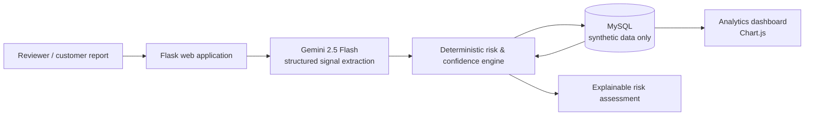

# Food Safety Intelligence

Food Safety Intelligence is an AI-assisted decision-support prototype that turns a customer food-quality report and synthetic restaurant-operational signals into an explainable food-risk assessment. It is designed to help food-safety teams prioritize review; it does **not** diagnose illness, confirm contamination, or replace inspectors and public-health authorities.

> **Data safety:** Every record in the included seed database is fictional and synthetic. Do not upload personal, medical, or real customer data.

## Why this matters

Food-safety complaints are often unstructured and difficult to prioritize consistently. Teams must quickly identify potential hygiene signals while also considering the establishment's complaint, refund, rating, review, and incident context. This prototype demonstrates a transparent workflow that makes those inputs visible instead of treating AI output as a black box.

## What it does

- Uses Gemini to summarize a free-text food report and extract a controlled set of food-safety signals.
- Applies rule-based severity caps for critical and high-risk signals.
- Combines the report score with synthetic operational context: rating, order volume, complaint/refund rates, review sentiment, and prior incident count.
- Returns an explainable confidence score, risk tier, detected signals, and the factors behind the result.
- Stores analyses and incident signals, then visualizes aggregate trends in an analytics dashboard.

## AI innovation

The LLM is used for a bounded task: converting messy natural language into a controlled signal vocabulary and an evidence-led summary. A deterministic scoring layer then applies visible safety rules and business context. This hybrid design makes the final score inspectable and prevents an LLM from being the sole decision-maker.

## Architecture



For a standalone diagram, see [docs/architecture.md](docs/architecture.md).

## Technology stack

| Layer | Technology |
| --- | --- |
| Web application | Python, Flask, Gunicorn |
| Generative AI | Google Gemini 2.5 Flash via `google-generativeai` |
| Decision engine | Transparent Python rules and weighted scoring |
| Data | MySQL, synthetic seed data |
| Visualization | Chart.js |
| Report export | ReportLab |
| Deployment | Render-compatible `Procfile` |

## How it works

1. A reviewer selects a fictional restaurant and describes a food-quality or hygiene concern.
2. Gemini returns a structured assessment with controlled detected signals and a severity level.
3. The rules engine applies any configured signal penalties and severity caps.
4. The confidence engine combines that result with synthetic restaurant metrics and historic incidents.
5. The application shows the assessment and its score components, then updates the dashboard using the stored synthetic record.

## Run locally

### Prerequisites

- Python 3.10+
- MySQL 8+
- A Gemini API key

### Setup

```bash
git clone https://github.com/adithya-24be/food-safety-intelligence.git
cd food-safety-intelligence
python -m venv .venv
source .venv/bin/activate  # Windows: .venv\\Scripts\\activate
pip install -r requirements.txt
mysql -u root -p < schema.sql
cp .env.example .env
```

Update `.env` with your database credentials and `GEMINI_API_KEY`, then run:

```bash
flask --app app run --debug
```

Open `http://127.0.0.1:5000`.

## Deploying

1. Create a new Python Web Service from this repository on Railway, Render, or an equivalent provider.
2. Set build command to `pip install -r requirements.txt`.
3. Set start command to `gunicorn app:app` (also defined in `Procfile`).
4. Add `GEMINI_API_KEY` and all `MYSQL*` values from `.env.example` as environment variables.
5. Initialize the connected MySQL database with `schema.sql` before opening the app.
6. Verify `/`, `/dashboard`, and `/history` in an incognito browser before sharing the URL with judges.

Never commit `.env` or credentials.

## Demo script

1. Select **Burger Hub**.
2. Enter: `The chicken smelled sour, was undercooked in the middle, and the packaging was damaged.`
3. Point out the extracted signals, the risk tier, and the score breakdown.
4. Open the dashboard to show how the synthetic incident is reflected in aggregate analytics.
5. Close with the guardrail: AI assists triage; people make the final food-safety decision.

## Repository layout

```text
app.py                  Flask routes and API
gemini_helper.py        Gemini structured signal extraction
scoring.py              Signal parsing and safety caps
confidence_engine.py    Explainable confidence calculation
schema.sql              Synthetic schema and demo seed data
templates/              Application pages
static/                 Browser styling and client code
docs/architecture.md    Architecture diagram
```

## Safety and limitations

- The application is a hackathon prototype for decision support, not a diagnostic or regulatory system.
- Outputs may be incomplete or wrong and must be reviewed by a qualified human.
- The included database and demo entities are synthetic.
- In a production system, implement authentication, audit logs, access controls, data retention policies, model evaluation, and escalation workflows.

## Roadmap

- Add authenticated reviewer workflows and audit trails.
- Validate the signal taxonomy with food-safety experts.
- Add calibrated risk models and evaluation against approved, de-identified datasets.
- Integrate verified inspection data and a human-feedback loop.
