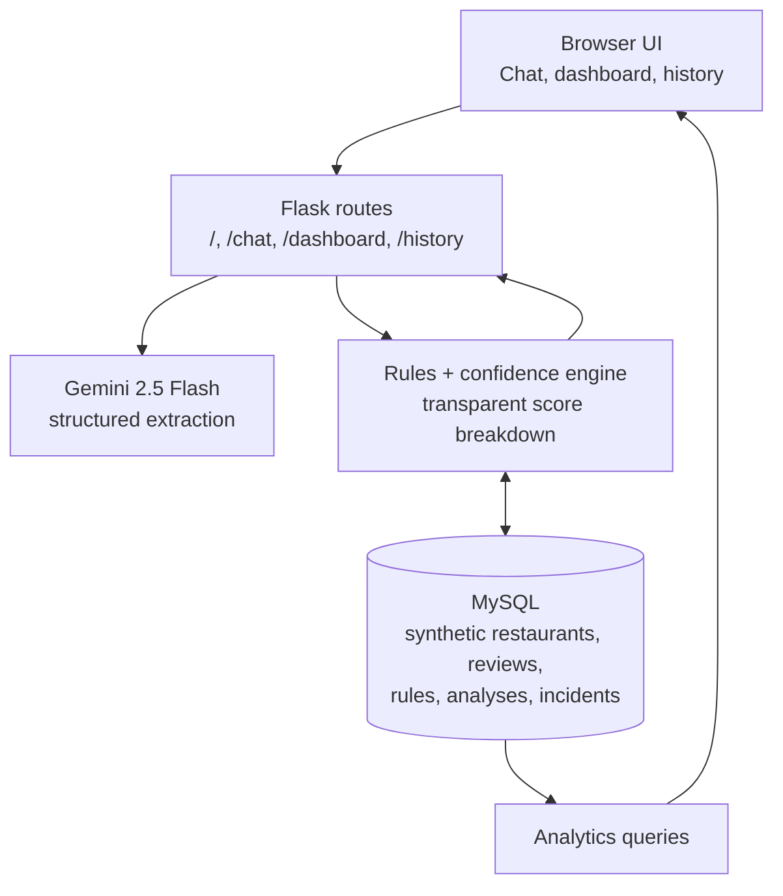

# System Architecture

## Data flow

1. A reviewer submits a text report for a fictional restaurant.
2. Gemini converts text to a constrained set of safety signals and a severity.
3. Python rules apply signal impacts and severity caps.
4. The confidence engine incorporates synthetic operational metrics and incident history.
5. The result and detected signals are saved to MySQL and shown with its breakdown.
6. Dashboard queries aggregate the saved synthetic analyses.

